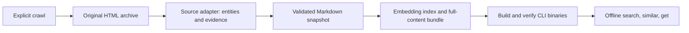

# pipelines

Scrape equipment websites and distribute their data as a single offline search CLI.
Users can find radars, emitters, vehicles, and other items by name or meaning, follow a
stable entity ID, and retrieve the complete scraped evidence behind that item.

The executable embeds the dataset, original HTML, Markdown, vectors, and query embedding
model. It requires no API key, Python installation, model download, or writable cache.
The Python scraper and release tools run separately from consuming applications.

## Scraper project



A source adapter defines which URLs to fetch and which items to extract. Shared code
handles crawl resume, archived response bytes, provenance, validation, embeddings, and
publication. A page can describe several items, and an item can retain several evidence
pages. Entity identities are independent of evidence-page identities.

Entities carry a canonical name, aliases, kind, categories, and facts with evidence URLs.
IDs are `source:item-key`; matching names do not automatically merge records across
sources. Every evidence page retains full extracted Markdown, its URL, title, language,
links, attribution, retrieval time, and HTML checksum. Original response bytes remain
exportable. Images, PDFs, and other attachments remain links rather than downloaded media.

The pinned model is `sentence-transformers/all-MiniLM-L6-v2`: 384 dimensions, attention-mask
mean pooling, and normalized vectors. The producer embeds an entity identity plus
overlapping evidence chunks. Adapters can select item-specific text for embedding when
several variants share a page; the complete evidence remains exportable. The Go CLI
embeds queries with the same model and scans
the vector matrix for exact cosine nearest neighbors, keeping one result per entity.

### Build a dataset

Development requires Python 3.13, uv, and Go 1.27. Keep source archives outside the repository
and application directories. Commands below assume a checkout of this repository.

```sh
uv sync --frozen --extra build --extra vector
uv run --no-sync pipeline-build sources
uv run --no-sync pipeline-build crawl radartutorial --root ../pipeline-data
uv run --no-sync pipeline-build crawl deagel --root ../pipeline-data
uv run --no-sync pipeline-build status radartutorial --root ../pipeline-data
uv run --no-sync pipeline-build model --output build/model
uv run --no-sync pipeline-build package --root ../pipeline-data --source radartutorial --source deagel --model build/model --cache build/vector-cache --output build/dataset.zip
uv run --no-sync python tools/build_cli.py --bundle build/dataset.zip --output dist/pipelines
uv run --no-sync python tools/accept_cli.py dist/pipelines build/dataset.zip
uv run --no-sync python tools/evaluate_cli.py dist/pipelines --output build/retrieval-evaluation.json
```

Deagel's full catalog discovery also requires Node.js and a browser on the producer:

```sh
npm install -g agent-browser@0.27.2
agent-browser install
```

On Windows, use `dist/pipelines.exe` in the final three commands. `crawl` is the only command
that requests source websites. It resumes unfinished work, or starts a new full archive
after a successful run. Nothing scrapes on application startup or on a schedule. `model`
downloads pinned, checksum-verified assets; packaging then works offline and caches
embeddings by model and text. Repeat `--source NAME` to package several source snapshots.

To change extraction without crawling again, use the archive ID reported by `status`:

```sh
uv run --no-sync pipeline-build extract radartutorial ARCHIVE_ID --root ../pipeline-data
```

Source storage is `DATA_ROOT/SOURCE/archives/CRAWL_ID/` for original HTML and a SQLite crawl
manifest, and `DATA_ROOT/SOURCE/published/snapshots/SNAPSHOT_ID/` for `entities.jsonl`, full
Markdown by evidence ID, and snapshot metadata. `published/current.json` selects the
current snapshot. The archive database is producer bookkeeping; runtime lookup uses the
embedded entity catalog and vectors.

A per-source lock prevents concurrent writers. Publication checks archive completeness,
HTML hashes, entity validity, minimum corpus size, and unexpected shrinkage before
atomically replacing the current pointer. Failed runs preserve the previous snapshot.
Archives and historical snapshots are retained. Older page-based snapshots can be migrated
by extracting their saved archive again; another crawl is unnecessary.

For containerized Radartutorial crawling or offline extraction of either source:

```sh
docker build --tag osint-pipelines:local .
docker run --rm --init --volume /absolute/path/to/pipeline-data:/data osint-pipelines:local crawl radartutorial --root /data
docker run --rm --network none --volume /absolute/path/to/pipeline-data:/data osint-pipelines:local extract radartutorial ARCHIVE_ID --root /data
```

The producer image does not include agent-browser or Chromium. Run Deagel's initial
catalog discovery on a host with those dependencies; extraction and packaging need no browser.

### Repository and tests

| Location | Purpose |
| --- | --- |
| `src/pipelines/sources/`, `src/pipelines/sources.toml` | Website adapters and registration |
| `src/pipelines/` | Archive, crawl, entity snapshots, embedding bundle, producer CLI |
| `cli/` | Offline Go search and retrieval executable |
| `tools/` | Bundle verification, binary builds, acceptance checks, releases |
| `tests/`, Go `*_test.go` files | Producer, adapter, consumer, and release tests |
| `.github/workflows/` | Code checks and explicitly dispatched CLI releases |

```sh
uv sync --frozen --extra build
uv run --no-sync ruff check .
uv run --no-sync ruff format --check .
uv run --no-sync mypy src tests tools
uv run --no-sync pytest
uv build
cd cli
go test -tags NODOWNLOAD ./...
go vet -tags NODOWNLOAD ./...
```

Tests use synthetic source fixtures and a local HTTP server. They cover crawl/resume,
failed-publication preservation, multiple sources, shared and merged evidence pages,
ranking, filters, exact exports, embedding integrity, and release gating. Real binary
acceptance runs against its own bundle. `pipelines verify` checks every bundle member,
entity/evidence relationships, normalized vectors, and Python/Go embedding parity.
The retrieval evaluator runs the source-specific cases in `tests/fixtures/retrieval.json`
against a real executable. Named-item regressions gate releases; broader semantic cases
report ranking quality separately. Missing sources are explicitly reported as skipped.

## Release mechanics

Releases are data-driven and manually initiated. Scraping, packaging, and releasing are
separate operations. The [Release CLI workflow](.github/workflows/release-cli.yml) has
only a manual dispatch trigger; ordinary CI never publishes a dataset or executable.

1. Explicitly crawl or extract the selected sources, then package their snapshots.
2. Build the CLI locally and run the acceptance and retrieval evaluation commands above.
3. Stage the verified bundle as a GitHub data prerelease:

   ```sh
   uv run --no-sync python tools/release.py stage --repo osint-builders/pipelines --bundle build/dataset.zip
   ```

4. Run the exact dispatch command printed by that helper:

   ```sh
   gh workflow run release-cli.yml --repo osint-builders/pipelines -f input_tag=data-CONTENT_SHA256
   ```

The release gate compares the new content fingerprint with the latest CLI release.
Unchanged content skips building and publishing. The fingerprint includes extracted entity
metadata, full Markdown, and selected search text, but excludes retrieval timestamps and
raw HTML hashes. Repeated Deagel responses contain changing Blazor transport bytes even
when the extracted content is identical. HTML checksums still protect archived bytes and
bundle integrity; transport-only changes do not trigger a release. Model/recipe hashes are
tracked separately; code-only and model-only changes do not trigger a CLI release.

Every platform job consumes the exact same verified bundle. Native runners build and test
Linux/macOS amd64 and arm64, plus Windows amd64, with `CGO_ENABLED=0`. Linux amd64 also
verifies inside a read-only container with networking disabled. All five builds must pass
before publication. A draft becomes public only after its assets are checked for
completeness. Existing published binaries are never overwritten.

Data input tags use `data-CONTENT_SHA256`; CLI release tags use `cli-DATASET_ID`. Releases
contain five executables, `dataset-manifest.json`, and `SHA256SUMS`. The content-addressed
bundle contains the entity catalog, complete evidence, original HTML, embedding vectors,
model assets, and checksums. Generated archives, models, bundles, and binaries stay out
of Git history. License notices remain embedded and available through the CLI.

## Sources

| Source | Searchable content | Current built corpus |
| --- | --- | --- |
| [Radartutorial](https://www.radartutorial.eu/index.en.html) | English equipment catalog pages | 1,735 entities: 1,710 radar and 25 equipment |
| [Deagel Armies](https://www.deagel.com/Armies/) | English land equipment and its variants, across all four status filters | 1,285 entities from 797 family pages |

Radartutorial discovery follows English sitemaps, indexes, manufacturer names, and links.
The crawler obeys robots.txt, limits concurrency to two, and applies delay/throttling.
Tutorials, navigation pages, and event reports do not become search results. They may
remain in the discovery archive. Extraction retains technical tables, tooltips, captions,
references, and attribution, while removing duplicate layout. Source content retains its
[original terms](https://www.radartutorial.eu/html/copyright.en.html) and individual credits.

### Deagel discovery and extraction

The Armies catalog offers keyword, status, group, origin, and operator controls. Their
interactive updates do not expose navigable query URLs. The default catalog contains
1,162 variant links across 742 family pages; selecting Active, Under Development,
Cancelled, and Retired reveals 1,269 links across 798 family pages. Discovery uses one
agent-browser session to select all statuses, saves the rendered catalog with a checksum,
and reuses it when resuming the archive. Browser discovery checks robots.txt before
opening the catalog. The shared HTTP crawler fetches the deduplicated family URLs with
robots enforcement, throttling, and resume support.

Detail responses are Blazor streams: the initial HTML says "Loading", but a later
`template[blazor-component-id]` contains the equipment data. Re-parsing that template
produces the completed detail component without rendering every page in a browser.
Relative links resolve against the site's root base URL. A native family ID and variant
anchor produce IDs such as `deagel:a000516-003` for M1A2 Abrams; renamed URL slugs do not
change that identity. The entity URL points directly to its variant anchor.

Extraction retains variant names and aliases, source categories, origin/operator/status
metadata, descriptions, and specification tables with original units and notes. Each
variant embeds only its own section. Full family Markdown, visible news/gallery links,
and original HTML remain available through `get`. Other site catalogs, linked articles,
additional news/gallery pagination, and media downloads are outside this source's scope.
Source assertions and copyright notices are retained as published; they are not independent
verification of equipment specifications.

The September 20, 2026 UTC crawl saved 797 of 798 catalog family pages. The IMCP + PCP
page (`a002660`) returned HTTP 404 and is recorded as unavailable. Family detail pages
also expose 17 variants absent from the filtered index: 1,268 catalog entries plus those
17 variants produce 1,285 entities. These include 813 vehicles, 394 weapons, 37 radars,
13 sensors, and 28 other equipment records. Publication succeeded after validating every
entity and retained page; the same archive was then extracted in a container with
networking disabled.

Evaluation compared raw HTTP, rendered browser content, offline extraction, and retrieval.
The streamed Abrams response and browser rendering exposed the same seven variants.
A six-family, 19-variant embedding comparison used eight queries: selecting variant
sections reduced chunks from 496 to 92 and increased top-one matches from 5/8 to 6/8;
both approaches achieved 7/8 within the first five. This small diagnostic supported
variant-scoped embeddings, but is not a broad quality benchmark. The generic query
"passive artillery locator using sound and infrared sensors" still ranked Penicillin
seventh in that sample; model similarity alone does not reliably infer every capability.
Repeat-response checks also confirmed identical extraction despite different transport
bytes. Automated tests cover both streamed and rendered pages, stable IDs, table fidelity,
scope exclusions, robots rejection, cached discovery, and offline re-extraction.

The combined 3,020-entity executable contains 10,972 vectors and 2,532 evidence pages.
All six named-item regression queries returned their expected entity first. In the full
Deagel corpus, the range/target-count radar query ranked its expected variant fourth,
while the generic sound-and-infrared query placed Penicillin outside the first 20.
These diagnostic misses are reported explicitly rather than treated as successful
retrieval. Exact HTML/Markdown exports passed for both sources, and packaging the
unchanged snapshots returned `changed: false` with the same dataset ID.

### Add another website

Implement the [Source protocol](src/pipelines/sources/base.py) in
`src/pipelines/sources/`, then register its import path in
[src/pipelines/sources.toml](src/pipelines/sources.toml). No website-specific changes are
needed in the shared builder, bundle format, or consumer CLI.

| Adapter member | Responsibility |
| --- | --- |
| `id`, `version` | Source namespace matching registration; discovery compatibility version |
| `seeds`, `minimum_entities` | Initial URLs and a lower bound that protects publication |
| `normalize(url)` | Canonical in-scope URL, or `None`; enforce host, language, and path scope |
| `discover(url, body)` | Links discovered from saved response bytes |
| `labels(url, body)` | Explicit catalog names keyed by canonical item URL, or `{}` |
| `extract(url, body, names)` | Zero or more entities derived from the current archived page |
| `discovery_seeds(archive_directory)` (optional) | Additional catalog discovery captured once per archive, for sites requiring interaction |

Use [Entity and Evidence](src/pipelines/model.py) for extraction. Each emitted entity needs
a stable source-native key, canonical title, kind, and one evidence record for the current
page. The builder attaches retrieval time and the HTML hash. Return `[]` for non-item pages;
extraction must not fetch other pages. Keys are 1-128 ASCII letters/digits/dots/underscores/
hyphens and start with a letter or digit. Prefer catalog IDs over names or crawl order.

Emit the same key/title/kind from multiple pages only when the source establishes they
refer to the same item. Their evidence, aliases, and facts merge; conflicting identities
fail publication. Several items can share a catalog page, but each must retain identical
full Markdown for it. Prefer item detail pages when available to avoid ambiguous shared
text. Facts point to retained evidence URLs or anchors, and aliases name the item itself.
Set `Evidence.search_text` to an item's own section when shared-page text would confuse
sibling variants. Leave it empty to embed full Markdown. This never replaces the retained
full evidence. An optional `Entity.url` may select an anchor within a retained page.
Implement the separate `SupplementalDiscovery` protocol only when ordinary archived HTML
cannot expose the complete catalog; offline extraction never invokes that capability.

Supported kinds are `radar`, `emitter`, `sensor`, `vehicle`, `aircraft`, `vessel`, `weapon`,
`equipment`, and `item`. Categories provide source-specific distinctions. Country and
manufacturer facts need source evidence; cross-source entity resolution and attachment
OCR are not implemented.

Add fixtures covering URL scope, identity, exclusion of non-items, extraction fidelity,
and any catalog/multi-page behavior. [The independent catalog fixture](tests/test_sources.py)
already exercises vehicles and emitters alongside radar data, shared evidence, and
multi-page entities. It is a test adapter, not a production website. Bump the
adapter version when discovery changes make an unfinished crawl unsafe to resume.

## CLI API and installation

Download the executable for your platform from
[GitHub Releases](https://github.com/osint-builders/pipelines/releases). If no release is
available yet, build locally using the commands above.

| Platform | Release asset |
| --- | --- |
| Linux x86-64 / ARM64 | `pipelines-linux-amd64` / `pipelines-linux-arm64` |
| macOS Intel / Apple Silicon | `pipelines-darwin-amd64` / `pipelines-darwin-arm64` |
| Windows x86-64 | `pipelines-windows-amd64.exe` |

Check the download against `SHA256SUMS`, rename it to `pipelines` (`pipelines.exe` on
Windows), and place it on your PATH. On Linux/macOS, run `chmod +x pipelines`. No separate
dataset, service, API key, or first-run model download is required.

| Command | Result |
| --- | --- |
| `pipelines search [--mode hybrid\|vector] [--limit N] [filters] "query"` | Ranked, deduplicated entities |
| `pipelines similar [--limit N] [filters] SOURCE:ID` | Nearest entities, excluding the input entity |
| `pipelines get [--format json\|markdown\|html] [--evidence PAGE_ID] SOURCE:ID` | Complete entity/evidence export |
| `pipelines info` | Dataset identity, counts, model, and included sources |
| `pipelines verify` | Bundle integrity and cross-runtime embedding checks |
| `pipelines version` | Executable version |
| `pipelines notices` | Model and dependency license notices |
| `pipelines --help` | Command usage |

Filters are `--source SOURCE`, `--kind KIND`, and `--category CATEGORY`; they apply before
the result limit. The default limit is 10, with a range of 1-100. Place flags before the
quoted query or ID. Queries are limited to 1,000 characters and 256 model tokens. There
is currently no structured country or numeric-fact filter.

```sh
pipelines search "russian cheeseboard"
pipelines search --source deagel "M142 HIMARS wheeled rocket artillery launcher"
pipelines search --mode vector --kind radar "detect aircraft approaching an airport"
pipelines similar --limit 5 radartutorial:8bdc6ce92fea3ca62de71395
pipelines get radartutorial:8bdc6ce92fea3ca62de71395
pipelines get --format markdown radartutorial:8bdc6ce92fea3ca62de71395
pipelines get --format html radartutorial:8bdc6ce92fea3ca62de71395
pipelines get deagel:a000516-003
```

Search emits JSON with `dataset_id`, query/mode, and `results`. Each result includes its
stable `id`, title, source URL, kind, categories, aliases, `score`, raw `cosine`,
`name_match`, snippet, and `evidence_id`. An empty evidence ID denotes an identity match.
Hybrid mode adds a name/alias boost; vector mode ranks solely by cosine. `similar` uses
the selected entity's identity vector. Scores indicate retrieval similarity, not verified
attributes or confidence. The current dataset returns 96L6E "Cheese Board" first for
`russian cheeseboard` in both modes.

`get` defaults to JSON with the complete entity and all evidence pages, including full
Markdown, provenance, and HTML. Non-UTF-8 HTML is represented by `html_base64`. Markdown
output joins all retained pages; `--evidence PAGE_ID` selects one. HTML output preserves
original response bytes and requires an evidence ID when the entity has multiple pages.
Commands return nonzero on failure with a JSON `error` on stderr. All consumer operations
work offline and never start a crawl or update the dataset.
