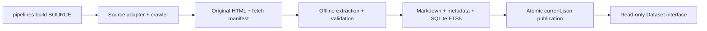

# Architecture

The builder and reader share a filesystem format. A consuming application installs the
reader or invokes the CLI; it does not need the crawler's dependencies or lifecycle.



## Storage and publication

Choose a data root on a local filesystem with file locking and atomic rename support.
The root is an explicit CLI argument and can be shared with multiple consuming applications.

```text
pipeline-data/
  radartutorial/
    writer.lock
    work.json
    archives/<crawl-id>/
      html/<url-sha256>.html
      manifest.sqlite
      complete.json
      progress.json
    published/
      current.json
      snapshots/<snapshot-id>/
        manifest.json
        documents.jsonl
        markdown/<document-id>.md
        index.sqlite
```

Response files contain the original payload bytes before extraction. XML discovery
responses and non-200 bodies are also retained. The archive manifest records URL,
status, headers, content type, SHA-256, retrieval time, and crawl disposition.
Hashed filenames avoid URL collisions and unsafe filesystem names.

A per-source lock allows one writer. `work.json` identifies unfinished work. An explicit
build resumes pending URLs and replays saved discovery, including links missed during a
crash. A successful build removes `work.json`; the next build creates a fresh archive.
Archives and old snapshots are retained until the operator removes them.

Status reads JSON progress and published snapshots. Inspect an active archive database
only from its writer's environment. Reading it from the Windows host while Docker writes
can cause filesystem locking conflicts.

Conversion reads saved responses and checks their hashes. Publication requires a complete
archive, successful extraction, the adapter's minimum document count, SQLite and FTS
integrity, and no corpus shrinkage greater than 10%. Failures retain the prior publication.
The builder replaces `current.json` atomically after all checks pass. Existing readers
remain pinned to their immutable snapshot.

## Radartutorial adapter

Discovery combines the English sitemap, chapter and alphabetical indexes, keyword and
abbreviation pages, manufacturer index, and links between English pages. The random-radar
navigation page contains a literal JavaScript array; discovery parses it without execution.

Only allowed hosts and English HTML paths are fetched. The bilingual manufacturer index
is a discovery helper. External redirects are excluded. Scrapy obeys robots.txt, limits
concurrency to two, waits at least 0.5 seconds between requests, and throttles automatically.
Missing 404/410 pages are recorded; other exhausted failures prevent publication.

Pages marked `noindex` support discovery but are omitted from search. The XML sitemap,
manufacturer helper, and random-page navigation shell are omitted as well.

Extraction retains prose, technical tables, captions, links, references, image credits,
and explanatory tooltips. It removes scripts and duplicate print/mobile content, resolves
relative links, and retains inline subscripts and superscripts. Diagrams and equations
remain image references. Image-only pages retain those references without invented text.

Radar names come from titles and explicit equipment indexes. Multiple names can describe
one page without asserting that the names identify equivalent products. Numeric parsing
only normalizes simple values and ranges. Operating modes, alternatives, uncertainty,
and complex expressions remain source text.

Each document contains its URL, title, language, kind, names, categories, facts, links,
attribution, retrieval time, and HTML hash. Each fact keeps the raw value and an evidence
URL, including the original cell anchor when available.

## Search

Search treats queries as literal terms, never raw SQL or FTS syntax. Normalized exact names
rank first, followed by section-level FTS5/BM25 matches with title/name weighting.
Results deduplicate to documents. Snippets are computed after the result limit.

The reader supports kind/category filters, browsing with an empty query, prefix lookup,
pagination, document reads, and URL lookup that ignores fragments. Each connection has
a 64 MiB page-cache budget. `search_all` combines source results by rank, avoiding direct
comparison of BM25 scores from separate indexes.

Structured facts remain available in document metadata. Arbitrary numeric comparisons
are not search filters. Missing content raises an error and never triggers a fetch.

## Add another source

Implement `pipelines.sources.base.Source` and register the adapter in
`src/pipelines/sources.toml`. A source owns its identity/version, seeds, URL scope,
discovery, index names, extraction, and minimum corpus size. The shared builder owns
retries, archives, checks, and publication.

Increase the adapter version when a discovery change makes an unfinished crawl unsafe
to resume. The builder rejects a version mismatch so an operator can inspect the work.
Saved archives can be reindexed offline after extraction changes.

Use synthetic pages and a local fixture server for new adapters. Tests should cover URL
scope, extraction, resume, failure preservation, and the resulting reader behavior.
